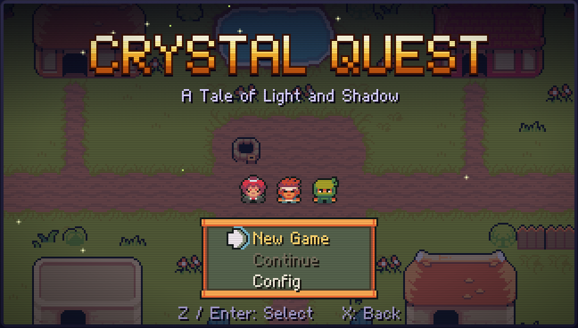
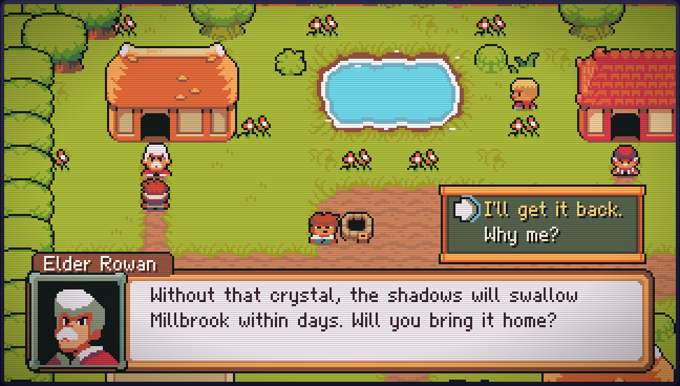
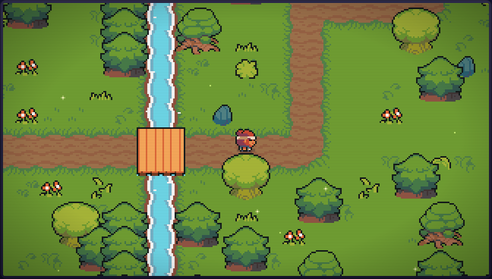
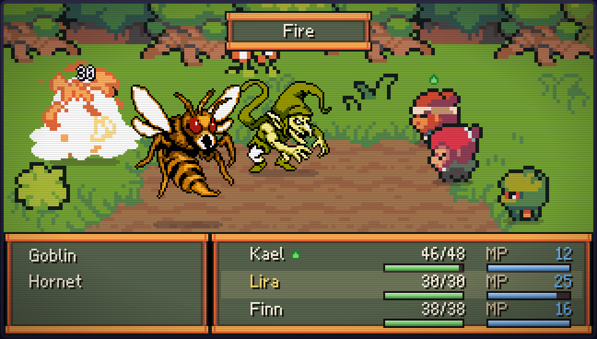
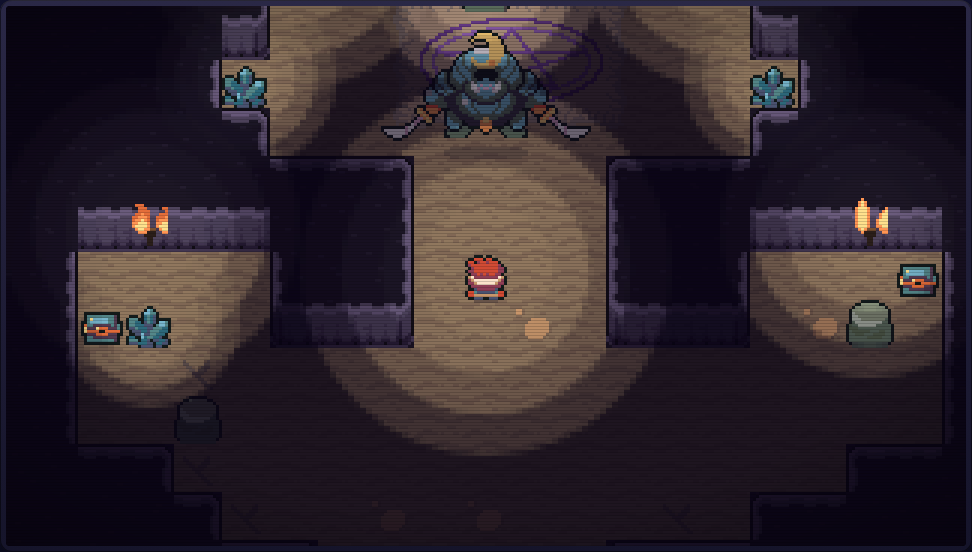
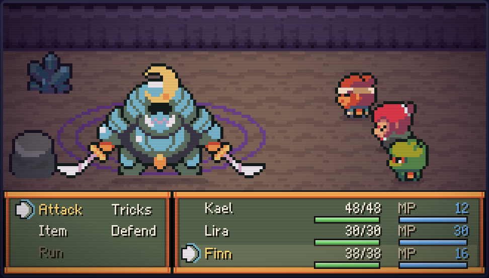
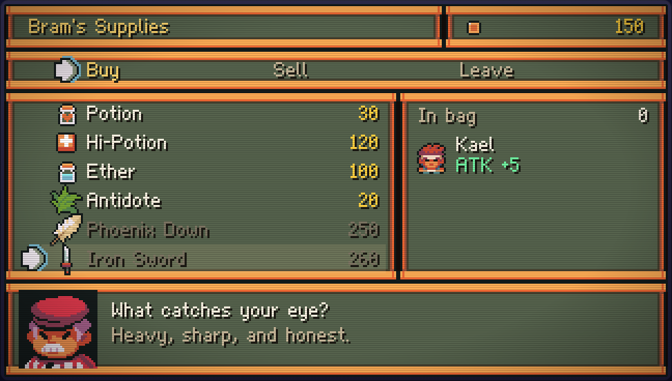
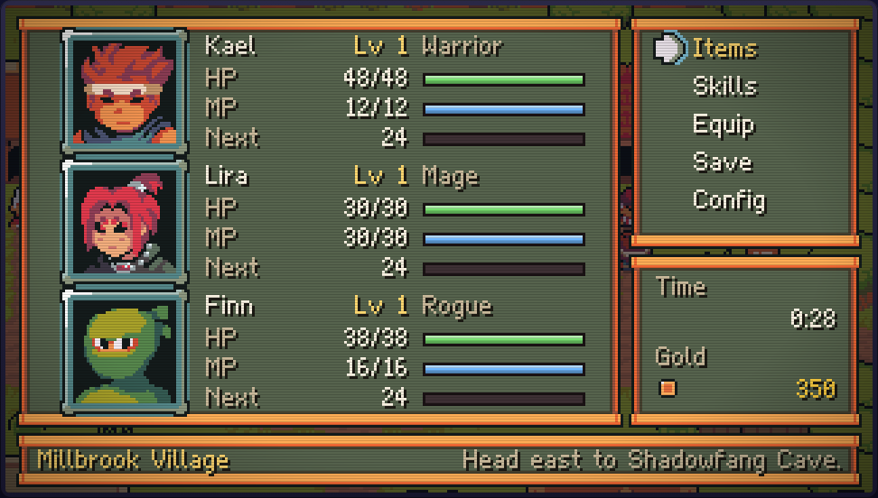
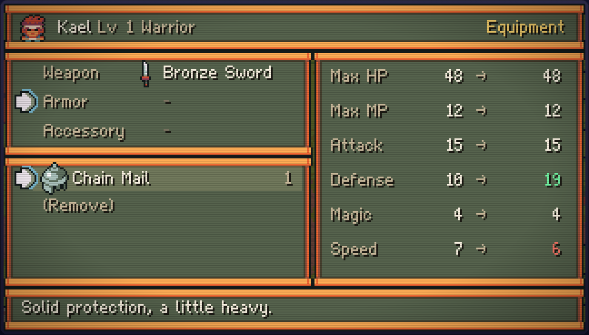
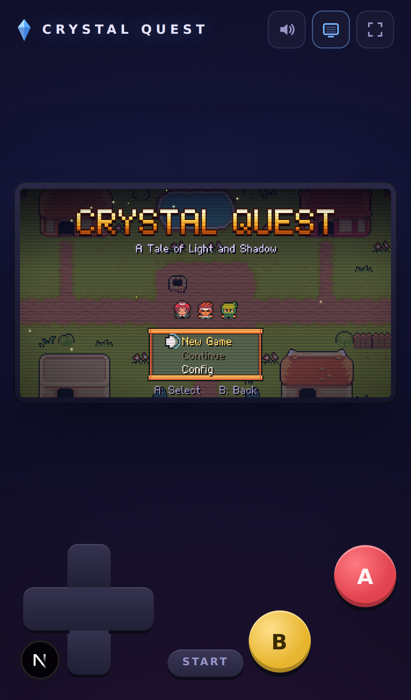

# Crystal Quest

A small top-down JRPG that runs in the browser. A giant samurai wrapped in shadow has stolen the Crystal of Light from the village of Millbrook, and it's up to Kael (plus whoever he can talk into coming along) to get it back.

It plays like the 16-bit games it borrows from: turn-based battles with bouncing damage numbers, a mosaic swirl when a fight starts, a pause menu with portraits, a shop, equipment and three save files. The art, music and sound come from two free pixel-art packs: [Ninja Adventure](https://pixel-boy.itch.io/ninja-adventure-asset-pack) for the world, characters, menus and audio, and [Mythic Monsters](https://willibab.itch.io/free-mythic-monsters) for the creatures you fight. See [CREDITS.md](CREDITS.md) for details.

The game draws at 320×180 and scales up with crisp pixels, so it fits a widescreen monitor or a phone held sideways.



| | |
|---|---|
|  |  |
|  |  |
|  |  |
|  |  |

## Playing

| Action | Keyboard | Touch |
|---|---|---|
| Move | Arrow keys or WASD | D-pad |
| Talk / confirm | Z, Enter or Space | A |
| Cancel | X or Backspace | B |
| Run | Hold X or Shift while walking | Hold B |
| Menu | Esc or C | START |

On phones and tablets the on-screen controls show up automatically. On a desktop you can switch them on with the gamepad button in the top bar. The bar also has buttons for sound, the CRT scanline filter and fullscreen.

The whole adventure takes about half an hour:

- **Millbrook:** talk to Elder Rowan, recruit Lira, shop at Bram's, rest at the inn.
- **Whispering Forest:** random encounters, a couple of treasure chests, and Finn, who has opinions about loot.
- **Shadowfang Cave:** darker and torch-lit, with tougher monsters and the Shadow Samurai waiting at the end.

You can save to one of three files from the menu any time you're not in a fight. Settings (window style, text speed, battle speed, sound, music, CRT filter) are remembered between visits. There are six window styles to pick from, all taken from the pack's UI themes.



## Running it

You'll need Node 20 or newer.

```bash
npm install
npm run dev        # http://localhost:3000
```

Other scripts:

```bash
npm run build      # production build
npm start          # serve the production build
npm test           # unit tests (Vitest)
npm run lint
npm run typecheck
```

## How it's put together

It's a Next.js app, but React only draws the page around the game: the bezel, the toolbar and the touch controls. The game itself is a single `<canvas>` driven by a small engine.

```
public/assets/   sprites, tilesets, UI, effects, music and sound (from the two packs)
src/
  engine/    game loop, input (keyboard + touch), scene stack, asset loading, audio
  gfx/       map tiles, characters, monsters, battle backdrops and effects, windows, font
  scenes/    loading, title, overworld, dialogue, menu, shop, battle, save, config, ending
  systems/   pure game rules: battle math, levelling, inventory, saves, settings
  data/      maps (as ASCII art), dialogue, characters, skills, items, enemies
  store/     zustand store holding the party, inventory, flags and settings
  world/     pre-renders each map's ground layer
```

A few things worth knowing if you want to change something:

- **Maps are ASCII.** Each map in `src/data/maps.ts` is a grid of characters (`.` grass, `=` path, `T` tree, `%` rock wall and so on). The legend is at the top of the file and in `src/gfx/tiles.ts`. Paths, shorelines and cliffs are joined up automatically using the tileset's own 47-tile blending layout, so you only ever type one character per tile.
- **Houses are 4×3 tiles** from the pack's house tileset. A map lists each one with a style (`cottage`, `hall`, `lodge` or `shop`), and the door is always in its second column.
- **Characters are sprite sheets.** A character's `look` (like `kael` or `elder`) points at `public/assets/chars/<look>.png` for walking, attacking and casting, and at `public/assets/faces/<look>.png` for the dialogue portrait. `PORTRAITS` in `src/data/dialogues.ts` decides whose face shows next to each speaker.
- **Monsters** live in `public/assets/monsters/<enemy id>.png`. The samurai boss is drawn from the pack's boss sprites at double size.
- **Dialogue drives the story.** Lines can set flags, start fights, open the shop, heal the party or add someone to it. NPCs pick what to say based on those flags.
- **Music and sound are plain files.** Each map names its track (`village`, `forest`, `cave`), which plays from `public/assets/music`. Sound effects and jingles are in `public/assets/sfx`.
- **The tests check the content too.** Besides battle maths and save files, they walk every map to make sure each exit, NPC and chest can actually be reached. They also check that every sprite, portrait, icon and track the code asks for exists on disk. Those are the kinds of mistakes that quietly break a game.

## Credits

Art, music and sound effects are by **Pixel-boy and AAA** ([Ninja Adventure](https://pixel-boy.itch.io/ninja-adventure-asset-pack), CC0). Battle monsters are by **Willibab** ([Mythic Monsters](https://willibab.itch.io/free-mythic-monsters), CC BY). The CC BY licence requires credit, so if you build on this project, please keep Willibab's name in [CREDITS.md](CREDITS.md) and in the game's ending.
